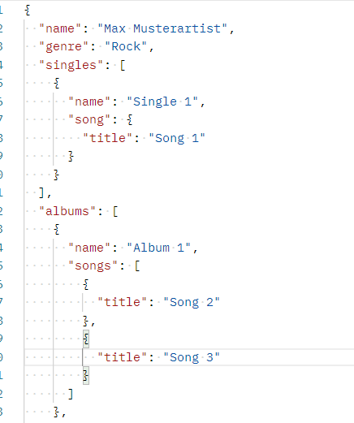

## 1.) Wozu dient die "Favorite Artists API" ?

### 1.1) Beschreibung

Diese API dient dem einfachen speichern und Veranschaulichung (via Webclient) von Künstlern.
Man kann sich also eine eigene Liste an Lieblingskünstlern und deren Alben und Songs speichern oder alternativ einfach irgendwelche Alben erfinden und in diese nur gewisse Lieblingssongs eines Künstlers hinzufügen.
Während die Desktopanwendung in WPF als Admintool dient also die Verwaltung der gesamten Daten ermöglicht hat man in der WebApp eine schöne Veranschaulichung der Daten wie auch die Möglichkeit diese zu filtern.

Ein Künstler beinhaltet folgende Werte:
- Name
- Genre
- Liste an Singles
	- Singlename
	- Singlesong
- Liste an Alben
	- Albumname
	- Liste an Albumsongs
	
Jeder Song hat außerdem noch einen eigenen Songtitel.
Artist im Json Format bei Postman:

### 1.2) Wie wurde die API geschrieben ?

#### Server
1. Zuerst werden sich express und mongoose geimportet.
Express ist ein Node.js Framework welches für den Server benötigt wird.
Mongoose ist eine Data object modeling library für MongoDb und NodeJs welche es mir ermöglichte ein Json Schema für meinen Artist zu erstellen.
mit "const app = express()" wird eine Instanz von express erstellt mit welcher später weitergearbeitet wird.
2. Als nächstes wird sich mit der mongodb collection artists verbunden und ausgegeben ob dies erfolgreich war, dies wird in der "isDatabaseConnected" variable gespeichert welche später für den Healthindicator also den Up oder Downstatus der Datenbankverbindung herangezogen wird.
3. Der nächste Teil war anfangs für den Server noch nicht relevant wurde dann jedoch sehr wichtig.
   Die app.use Funktion mit den verschiedenen Access Control headern wurde dafür benötigt um verschiedenen Clients den Zugriff zur API zu ermöglichen wenn diese von verschiedemen Ursprung sind.
   Dies ist auch bekannt als CORS (Cross origin ressource sharing) und ermöglicht dem Server das antworten auf alle Requests bzw Anfragen von verschiedensen Herkünften bzw. Clients.
4. app.use(express.json()) erlaubt es dem Server mit JSON data zu arbeiten.
5. Der Artistrouter beinhaltet die verschiedenen CRUD Endpoints.
6. app.use (/Artists, Artistrouter) sorgt dafür dass der Server mit diesen CRUD Endpoints arbeiten kann.
7. Im nächsten Abschnitt wird nochmal geprüft ob die Verbindung zu Datenbank funktioniert und setzt die Variable dementsprechend.
8.  app.get(/health) ist der Endpoint welcher den Datenbank Verbindungsstatus anzeigt.
9. Am Ende wirdnoch der Port angegeben auf welchem der Server hört bzw. läuft, als auch für den Falle einer unbehandelten Ausnahme vorgesorgt welche dann als log error in der Console ausgegeben wird.
![[DownStatus.png]]
![[UpStatus.png]]
![[Pasted image 20230521193701.png]]
![[Pasted image 20230521201811.png]]

![[Pasted image 20230521202315.png]]
#### Endpoints
1.  Zuerst werden wieder die benötigten module und dependencies heruntergeladen.
2. In der GET bzw. Getall funktion werden die Daten aller Artists abgerufen und als JSON response zurückgegeben.
   Sollte bei dem abrufen der Daten ein fehler auftreten wird der Errorcode 500 mit einer error message ausgegeben.
   Async und Await werden bei asynchronen Methoden benötigt, await stoppt den derzeitigen Prozess bis das verlangte Ergebnis vorhanden bzw. angekommen ist.
   Bei "await Artist.find()" wird solange gewartet bis Artists gefunden wurden oder dies nicht möglich ist und der Errorcode geworfen wird. 
3. Bei der GET by id oder Get one funktion wird eine id mitgegeben, mit welcher getArtist funktion nach genau dem Artist sucht zu welcher diese mitgegeben id angehört.
   Mit "res.json(res.artist.name)" wird der artistname als json response zurückgegeben was für das testen der Get by id methode hilfreich war
   Der Pfad lautet hier dann localhost:3001/artists/{id}
4. Bei der POST Methode wird mit den mitgegebenen Daten ein Artist erstellt und anschließend auf der Datenbank (MongoDB) gespeichert.
   Wenn das erstellen des Artists gelungen ist wird der Statuscode "201" welcher Erfolg bedeutet ausgegeben.
   Bei einem Fehler wird der Statuscode "500" mit einer Errormessage ausgegeben.
5. Bei der DELETE Methode wird eine id mitgegeben, mit welcher man durch die getArtist methode einen zugehörigen Artist sucht.
   mit "await res.artist.deleteOne()" wird auf einen response gewartet und dieser wird dann von der Datenbank gelöscht.
   Wenn dieser Prozess erfolgreich war wird einfach nur die Json nachricht "Artist gelöscht" ausgegeben.
   Bei einem Fehler wird der Fehlercode "400" mit der Errormessage ausgegeben.
6. Bei der PUT oder UPDATE Methode wird eine id mitgeben mit welcher man durch die getArtist methode einen zugehörigen Artist sucht und dessen Attribute dann durch neue eines requested Artist ersetzt werden.
   Der requested Artist, als auch dessen id werden im Desktop Client dabei für die Put Methode mitgegeben und seine id dafür verwendet um die Attribute des alten Artist durch die des neuen mitgegebenen zu ändern. 
![[Pasted image 20230522202644.png]]
![[Pasted image 20230522203008.png]]
![[Pasted image 20230522203528.png]]
![[Pasted image 20230522205714.png]]

### Anwendung der API im WPF Client
Der WPF Client sollte als Admintool dienen um Artists ohne Probleme verwalten zu können.
Man hat daher alle benötigten Optionen:
* Create mit welcher man einen Artist mit den benötigten Werten "Name" und "Genre" erstellen kann
* Update mit welcher man "Name" und "Genre" eines Artists ändern kann, als auch "Singles" und "Alben" hinzufügen oder ändern kann, wenn man zuvor auf den Artist in der Liste am Ende des Fensters klickt und in der darauffolgenden "Artistview" weiterbearbeitet.
* Delete mit welcher man über die ID eines Artists diesen löschen kann.
  Um die ID zu bekommen kann man einfach auf einen Artist in der Liste klicken und sich dessen ID aus dem "Artistview" Window löschen.
![[Pasted image 20230605193843.png]]
Wenn man auf einen Artist klickt öffnet sich das Artistview Window, hierbei hat der Benutzer einige Möglichkeiten: 
* ID kopieren, jedoch nicht ändern
* Name und Genre abändern, dies wird sobald man das Fenster schließt oder in ein weiteres Textfeld navigiert übernommen und im Hauptwindow mit dem "Update" Button  über die API an die Datenbank weitergegeben und gespeichert.
* Das Erstellen von einem Album oder einer Single
	* Hierbei wird ein leeres Objekt erstellt, in dem Beispiel Screenshot sieht man dass die leeren Objekte Default also Standardnamen zugewiesen bekommen.
	  Um dann ein richtiges Album oder eine richtige Single zu erstellen muss man in deren jeweiligen Fenster navigieren und ihnen dort Namen als auch Song oder Songs zuweisen.
![[Pasted image 20230605194223.png]]
Im folgenden Albumview Fenster hat man wieder einige Möglichkeiten:
* Man kann den Albumnamen eingeben und jederzeit ändern und im Nachhinein updaten.
  Wenn man in ein Album hineinklickt wird automatisch das Objekt mitgegeben und der Albumname, welcher beim erstellen Anfangs "Default Name" ist im Textfeld eingefügt.
  Dies funktionierte in dem ich beim öffnen eines Fensters immer mein benötigtes Objekt als Parameter mitgebe und es als Datacontext festlege.
  Dadurch kann ich im WPF xaml code bindings verteilen, diese Bindings kann man sich als Verbindung zwischen WPF Element und meinem mitgegeben Objekt vorstellen.
  Das Albumname Textfeld hat also eine Verbindung zu dem Albumnamen des mitgegebenen Albumobjektes.
* Um das Updaten der Songs zu ermöglichen hab ich eine Funktion erstellt welche erkennt wenn ein Song augewählt/angeklickt wurde und diesen Dann im Textfeld einfügt und bearbeitbar macht.
  Damit man im Anschluss auch wieder neue Songs hinzufügen kann musste ich einen Button "Unselect List" einfügen, welcher dafür sorgt dass der angeklickte Song in der Liste nicht mehr mit dem Textfeld verbunden ist und dass Songfeld wieder geleert wird.
* Ein weiteres Feature ist die erstellte Funktion welche es dem Benutzer erlaubt im Albumsong feld enter zu benutzen anstatt nach jedem Song auf "Add Song" zu klicken. 
![[Pasted image 20230605194630.png]]
Der Codeteil:
![[Pasted image 20230605200334.png]]
![[Pasted image 20230605200423.png]]
![[Pasted image 20230605201736.png]]
![[Pasted image 20230605201718.png]]
Das Fenster zum hinzufügen einer Single ist im Gegenzug sehr simple.
![[Pasted image 20230605203321.png]]
##### WPF CRUD im Code
In einer Separaten Klasse "API_Service" wurde ein HTTP Client erstellt und diesem eine BaseAddress zugewiesen.
Das bedeutet dass der httpclient alle seine CRUD Funktionen auf dieser Addresse anwendet. 
Wenn bei einer Funktion zusätzlich ein Endpoint als Parameter mitgegeben wurde wendet der Client die API Addresse + diesem Endpoint an.
![[Pasted image 20230605204732.png]]
![[Pasted image 20230605204750.png]]
Danach wurde dieser HTTP Client und dessen Funktionen im MainWindow benutzt indem ein Service Objekt erstellt wurde.
Wenn man nun das Programm startet wird sofort eine Artistliste erstellt welche von dem httpClient per Get Anfrage die gesamten Artist einträge bekommt und abspeichert.
* Create - Ein Artist wird erstellt und einer "lokalen" liste hinzugefügt welche im wpf zum anzeigen im Listview benutzt wird.
  Zusätzlich wird der erstellte Artist an die API gesendet und in der Datenbank gespeichert.
* Update - Für jeden Artist in der Liste wird die Update Funktion vom API Service aufgerufen
* Delete - Bei Delete wird nach der angegebenen ID gesucht und dieser Artist wird aus der Datenbank und WPF Liste gelöscht.
  Um das Crashen der Desktop Anwendung zu verhindern wurden Exceptions eingeführt und wenn diese auftreten werden passende Messageboxen angezeigt.
  Außerdem musste ich bei der Selection Changed Funktion eine kleine Änderung vornehmen. Diese wird aktiviert wenn man auf ein Element in der Liste klickt. Durch das löschen wurde die Auswahl jedoch ebenfalls geändert weshalb nach jedem Löschen ein Artistview geöffnet wurde.
  Um dem Gegenzuwirken wurde ein nullcheck eingefügt.
  
![[Pasted image 20230605205433.png]]
![[Pasted image 20230605210647.png]]
![[Pasted image 20230605210711.png]]
![[Pasted image 20230605210951.png]]
### Web Client
Der Web Client dient dem reinen Anzeigen der Songs.
Wenn man auf der Overview Seite in einer Songcard auf ein Album oder eine Single klickt öffnet sich ein Modal welches den Namen und die Songs bzw den Song des jeweiligen Objektes anzeigt.
![[Pasted image 20230605211640.png]]
![[Pasted image 20230605211859.png]]
![[Pasted image 20230605211923.png]]
Auf der Artists Seite kann man nach seinem Artist suchen oder einfach mehrere Artists filtern.
![[Pasted image 20230605212609.png]]
Auf der Songs Seite kann man alle Songs aus Alben und Singles filtern oder einfach einen Artist suchen und alle seine Songs anzeigen lassen.
![[Pasted image 20230605212805.png]]
![[Pasted image 20230605212902.png]]
Erwähnenswert ist hierbei dass alle Seiten responsiv sind, wodurch sich die Karten untereinander anordnen und die Navbar mit einem Toggler verfügbar wird.
![[Pasted image 20230605213027.png]]
#### Installieren von Lit
Lit diente dem einfachen verpacken meiner Navbar.
Meine Navbar wurde in ein Javascript file gepackt und als Lit Component gerendered.
Dies ermöglichte es mir den Component "my-navbar" in jeder html Seite zu laden.
Außerdem hab ich dadurch direkt eine Toggler Funktion von Lit benutzen können anstatt zu JQuery oder weiteren Methoden greifen zu müssen.
![[Pasted image 20230522173524.png]]
![[Pasted image 20230605212451.png]]
#### Probleme welche mich aufgehalten haben:
![[Pasted image 20230522181659.png]]
War ein einfacher Logikfehler auf den ich aber eine Zeit lang nicht gekommen bin.
Ich musste bei der Single zusätzlich noch in den Song gehen und das hatte dann folgenden Fehler bei der Anzeige gegeben:
![[Pasted image 20230522181828.png]]
![[Pasted image 20230522181904.png]]

Ein weiteres Problem stellte die Navbar dar welche ich responsiv haben wollte.
Bootstrap war eingebunden und die benötigten Funktionen waren eigentlich auch im Code vorhanden jedoch funktionierten diese nicht und ich wusste lange nicht wieso und hab diesen Teil erstmal pausiert. Später hab ich dann rausgefunden, dass für diese Funktionen JQuery eingebunden werden muss.
Dies funktionierte zwar aber ich habe noch nach einer weiteren Möglichkeit gesucht und herausgefunden dass mein Framework Lit ebenfalls eine Funktionalität dafür anbietet.
![[Pasted image 20230605213549.png]]
Abgesehen davon gab es noch unzählige Probleme in der Desktop Anwendung mit WPF wie zum Beispiel die Exception beim löschen von Einträgen, das aktualisieren der Datenbank als auch der in WPF erstellten Liste, das unselecten eines Songs in der Albumliste wie auch das ermöglichen vom Song bearbeiten aus der Albumliste.

Außerdem hab ich anfangs eine Methode gefunden um meine Daten aus der Datenbank (MongoDB) zu bekommen und auch auf diese zuzugreifen und sie zu verändern. 
Dies war mithilfe eines Nuggets ganz einfach Möglich.
Das ganze musste ich dann jedoch verwerfen, da mir bewusst wurde dass ich auf meine API zugreifen muss und nicht direkt auf meine Datenbank wodurch ich meinen bisherigen Fortschritt auf den Kopf stellen musste.
![[Pasted image 20230605213912.png]]